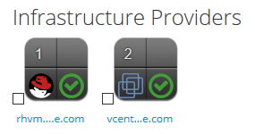

:scrollbar:
:data-uri:
:toc2:
:linkattrs:

== Introduction to Lab

:numbered:

== Access Lab Environment

Your CloudForms Customization lab environment contains the following:

* Student workstation
* CloudForms appliance
* Red Hat Virtualization Manager
* Red Hat Enterprise Linux + KVM host
* VMware vSphere + 2 ESXi hosts
* Red Hat Satellite
* Ansible Tower by Red Hat
* Infoblox IPAM appliance

[IMPORTANT]
The CloudForms appliance is fully configured with all of the above providers.

=== Access Lab Workstation

. Use SSH to access the lab workstation using your private SSH key and OPENTLC SSO credentials:
.. For macOS and Linux users, execute the following:
+
[source,text]
----
$ ssh -i /path/to/your/ssh-key your-opentlc-sso-login@workstation-$GUID.rhpds.opentlc.com
----
+
[NOTE]
Replace `$GUID` with your lab environment GUID provided in the provisioning email you received when ordering.  Replace `your-opentlc-sso-login` with your OPENTLC SSO user name.

.. For Windows users, consult link:https://www.opentlc.com/ssh.html[this page^] for documentation on using PuTTY.
+
[IMPORTANT]
To avoid problems when using SSH to access your OPENTLC lab hosts, always use the FQDN host name and not the IP or Ravello DNS entry.

. After logging in, make sure you can become `root` on the lab workstation:
+
[source,text]
----
$ sudo -i
#
----

=== Access Red Hat Enterprise Virtualization Console with macOS

[IMPORTANT]
Red Hat Enterprise Virtualization does not support macOS for VM console access. See link:https://access.redhat.com/solutions/93613[this page^] for unsupported steps on obtaining console access for macOS.

=== Verify Provider Authentication Status

When the CloudForms appliance and providers are down for any period of time (stopped overnight or initially provisioned in the lab environment) they lose connection to each other. CloudForms does not immediately re-establish connectivity. Every time you start your lab environment you must re-establish the communication between CloudForms and your providers. The appliance does attempt to reconnect at some point, but it may take hours, so it is best to follow the procedure below to get things running sooner.

[WARNING]
If you do not do this every time you start your environment, some of the labs will hang and you will have to start over.

. Log in to your CloudForms appliance at `https://cf-$GUID.rhpds.opentlc.com` as the `admin` user with the `r3dh4t1!` password.
+
[NOTE]
Replace `$GUID` with the GUID provided to you in the email you received from the OPENTLC lab system.

. Navigate to *Compute -> Infrastructure -> Providers*.

. Make sure all of your providers have  in the status quadrant as shown here:
+

. If your providers do not have a , you must re-check authentication status:
.. Click the provider and select *Authentication -> Re-check Authentication Status*:
+
image::images/recheck.png[]

. Select *Compute -> Infrastructure -> Providers* repeatedly until the provider's status is .

. Repeat this procedure for both Red Hat Virtualization and vSphere providers.
+
[IMPORTANT]
Verify each provider's status following _every_ lab environment shutdown.

== Lab 1 Instructions

1. Change directory to /home/student
+
----
cd /home/student
----
+
2. Clone the Tech Exchange repository from https://github.com/redhat-gpe/rhte-na.git
+
----
git clone https://github.com/redhat-gpe/rhte-na.git
----
+
3. Change directory to rhte-na/hybrid_cloud_management/labs/lab1
+
----
cd /home/student/rhte/na/hybrid_cloud_management/labs/lab1
