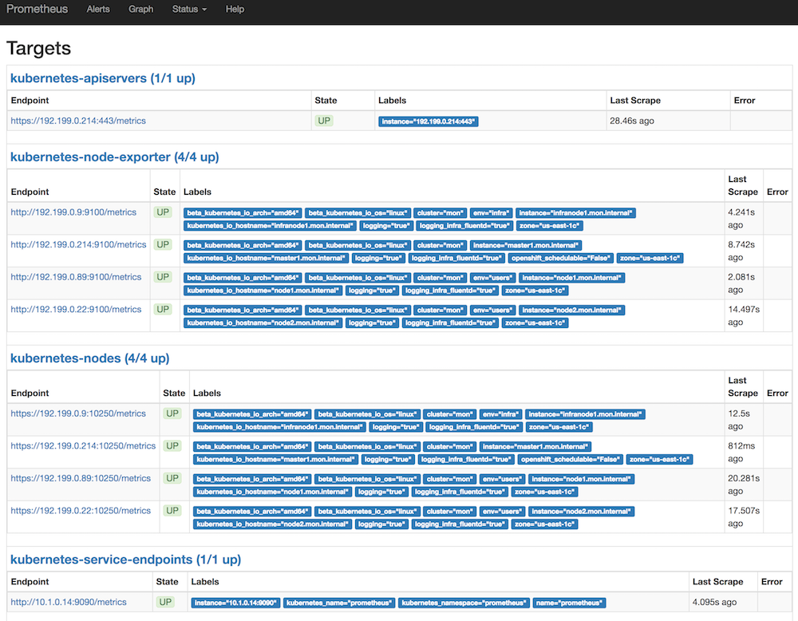
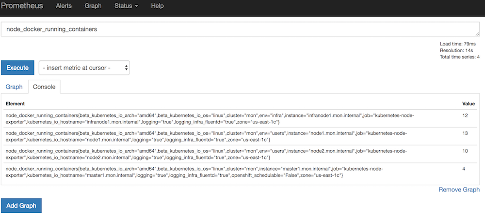
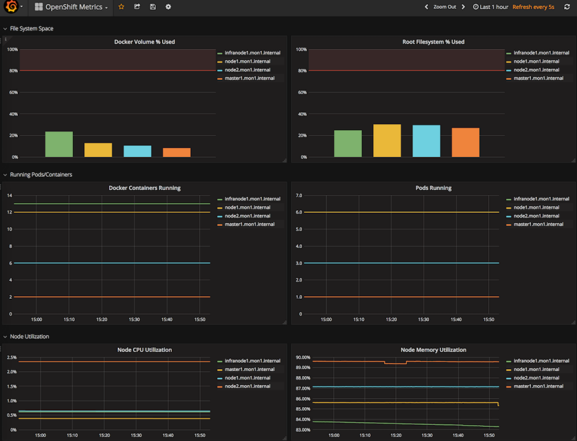

:scrollbar:
:data-uri:
:toc2:
:linkattrs:
:course_name: Red Hat OpenShift Operations

==  Prometheus Installation Lab

Prometheus and its related components can be set up completely on top of OpenShift. A set of templates is provided.

:numbered:

== Set Up Prometheus

. Log in to your OpenShift Bastion host and switch to the `root` user.

. Clone the repository containing all of the Prometheus setup code:
+
[source, bash]
----
cd /root
git clone https://github.com/wkulhanek/openshift-prometheus
cd openshift-prometheus
git checkout 3.6
----

. As a quick workaround, Fetch the "system:admin" credentials from `/root/.kube`
 on one of the masters.
+
[source, bash]
----
ansible masters[0] -m fetch -a"src=/root/.kube/config dest=/root/.kube/config flat=yes"
----

. Make sure you are logged into OpenShift as a user with cluster-admin privileges. Usually this will be the `system:admin` user.
+
[source, bash]
----
oc whoami
----

. Create an OpenShift project to hold Prometheus and all of the related components:
+
[source,bash]
----
oc new-project prometheus --display-name="Prometheus Monitoring"
----

. Display and read the "update_firewall.yml" playbook:
+
[source,bash]
----
vim ./update_firewall.yml
----

. Open port `1936` on the nodes so that Prometheus is able to monitor the routers:
+
[source,bash]
----
ansible-playbook ./update_firewall.yml
----
* As of the release of OpenShift Container Platform 3.6, the OpenShift routers
 expose a metrics endpoint on port `1936`. This port must be open for Prometheus
  to be able to monitor the routers.

. Find the router password:
+
[source,bash]
----
oc set env dc router -n default --list|grep STATS_PASSWORD|awk -F"=" '{print $2}'
----
* The router requires basic authentication to scrape the metrics.

. Instantiate the Prometheus template using the retrieved router password as a parameter:
+
[source,bash]
----
oc new-app -f prometheus.yaml --param ROUTER_PASSWORD=<Router Password>
----

. While Prometheus is deploying, examine the Prometheus template in `prometheus.yaml`.
* Prometheus runs under its own service account, and this service account is granted `cluster-reader` permission.
* The Prometheus service includes annotations (`prometheus.io/scrape: "true"` and `prometheus.io/scheme: http`) that allow Prometheus to monitor itself.
* Prometheus uses an EmptyDir to store data. This data will be lost upon Pod Restart. If persistent storage is required the Prometheus team recommends HostPath storage and not NFS backed storage.
* There are two configuration maps to configure Prometheus:
** The first configuration map (`prometheus`) contains the entire Prometheus configuration. It contains a section to point to rules for alerting.
*** Note how the configuration sets up the various `scrape_config` sections to identify targets for Prometheus.
** The second configuration map (`prometheus-rules`) contains the alerting rules. It is mounted in the location the first configuration map points to.
** Based on your requirements, you could customize these configurations.

== Set Up Node Exporter

Prometheus is able to self-discover a wealth of information. For Prometheus to display node and Docker metrics, it is necessary to deploy the _node exporter_. The node exporter runs as a link:https://docs.openshift.com/container-platform/latest/dev_guide/daemonsets.html[DaemonSet^] to guarantee that each node runs at least one copy of the application.

[NOTE]
To deploy a DaemonSet and set the correct permissions for the pods, your OpenShift user needs `cluster-admin` authorization.

. Switch to the `node-exporter` directory and run an Ansible Playbook to open port `9100` on every node in the cluster:
+
[source, bash]
----
cd /root/openshift-prometheus/node-exporter
ansible-playbook -i /etc/ansible/hosts update_firewall.yml
----

. Add the default service account in the `prometheus` project to the `privileged` SCC:
+
[source,bash]
----
oc adm policy add-scc-to-user privileged system:serviceaccount:prometheus:default
----
* Because the node exporter accesses resources from each host, the service account used to run the pod must be granted elevated access.

. Set an empty node selector for the `prometheus` project:
+
[source,bash]
----
oc annotate namespace prometheus openshift.io/node-selector=""
----
* Most OPENTLC environments include a default project node selector. This default node selector prevents the DaemonSet from placing pods on masters and infranodes.

. Deploy the DaemonSet:
+
[source,bash]
----
oc project prometheus
oc new-app -f node-exporter.yaml
----

. Switch to the directory containing the `dockerinfo` scripts and run an Ansible Playbook to distribute the script to all of the nodes and set up a `cron` job to execute the script at regular intervals:
+
[source,bash]
----
cd /root/openshift-prometheus/node-exporter/dockerinfo
ansible-playbook -i /etc/ansible/hosts install_dockerinfo.yml
----
* While the node exporter already provides a wealth of information about each node, if you want specific information about Docker and the Docker volume group, the repository contains a few scripts that run on each node to collect this information.

The Prometheus infrastructure setup is complete.

== Verify Prometheus Installation and Explore Capabilities

=== Verify Prometheus Infrastructure

In this section, you verify that Prometheus is set up properly by navigating to
 the route created for Prometheus and running a few sample queries.

. In your web browser, navigate to the `targets` page of your Prometheus server,
 replacing the route before `/targets` with your specific route--for example,
  link:http://prometheus-prometheus.apps.GUID.example.opentlc.com/targets[http://"prometheus-prometheus.apps.GUID.example.opentlc.com/targets"].

* Next to each endpoint, expect to see the state listed as `UP` in green.

** Some service endpoints may show as `Down` in red. That is OK for our environment. Typically these are routers that have been discovered by Prometheus - but where Prometheus was not able to authenticate to scrape metrics. We have a special config for our router at the bottom that includes the authentication necessary to connect to the router.

* There are four kinds of endpoints at the moment. Kubernetes includes built-in support for Prometheus, and you see the `kubernetes-node-exporter` endpoints for all of your nodes. Expect the number to match the number of `kubernetes-nodes` endpoints:
+

. Switch to the *Graph* tab to try a few Prometheus queries.

. In the *Expression* text box, type the following and then press `Enter`:
+
[source,text]
----
node_docker_running_containers
----
* Expect to see the number of running Docker containers for each node:
+

. Try a few node-specific queries, which come from the OpenShift node service itself:
* `node_memory_MemTotal`
* `node_memory_MemFree`
*  `node_cpu`

. Note the detailed CPU information returned.
+
[TIP]
To limit the CPU information to just the `user` mode, you can limit the query to just the `node_cpu {mode="user"}` label.

. Try queries for individual container metrics:
* `container_memory_usage_bytes`
* `container_cpu_usage_seconds_total`
* `container_network_receive_bytes_total`

. Check the other metrics that the `dockerinfo` script provides to the node exporters:
* `node_docker_volume_size_bytes`
* `node_docker_volume_data_percent_full`
* `node_docker_volume_meta_percent_full`

=== Explore Queries and Metrics

. Explore the queries.

. Examine all of the available metrics from the list box next to the *Execute* button.

. Switch from *Console* to *Graph* to show simplified graphical results of a query.

== Explore Grafana Dashboards

The volume of information in Prometheus can be overwhelming. It can be more useful to present users with beautiful, graphical dashboards. Fortunately, the open source dashboard software Grafana can display data from Prometheus as well as a number of other systems.

You can easily deploy Grafana alongside Prometheus.

=== Deploy Grafana

. On your Bastion host, make sure you are in the `prometheus` project and create the Grafana deployment:
+
[source,bash]
----
oc project prometheus
oc new-app -f https://raw.githubusercontent.com/wkulhanek/docker-openshift-grafana/3.6/grafana.yaml
oc get route grafana
----

. When you know your Grafana route (usually similar to `grafana-prometheus.apps.GUID.example.opentlc.com`), navigate to it in your web browser.

=== Configure Grafana Data Source

. Log in to Grafana using `admin` default account and `admin` as the password.
* It is a good idea to change the password after this.

. On the *Home* dashboard, click *Add data source*.
. For the `Config` data source, enter the following values:
* *Name*: `DS-Prometheus`
* *Type*: `Prometheus`
* HTTP Settings:
** *Url*: `http://prometheus:9090`
** *Access*: `proxy`

. Click *Add*.

. Click *Save & Test*.
* Expect to see a message indicating that the data source is working.

=== Configure Grafana Dashboard

In the repository, you can find an example dashboard JSON file called `openshift-metrics-dashboard.json`. This dashboard depends on metrics being collected by Prometheus as configured in previous steps of the lab.

There are more example dashboards available at link:https://grafana.com/dashboards?search=kubernetes["https://grafana.com/dashboards?search=kubernetes^"].

. Download this dashboard JSON file to your computer (*NOT* the Bastion host):
+
[source,bash]
----
cd $HOME
curl -O https://raw.githubusercontent.com/wkulhanek/docker-openshift-grafana/3.6/openshift-metrics-dashboard.json
----

. In Grafana, select the icon at the top left and then select *Dashboards -> Import*.

. Either copy/paste the contents of the JSON file you just downloaded (make sure to keep the correct formatting) or click *Upload .json File* selecting the JSON file from your `$HOME` directory.

. In the next dialog, enter `OpenShift Metrics` as the name and select the previously created `DS-Prometheus` data source for *Prometheus*.

. Click *Import*.
* Expect to see your dashboard with metrics coming from Prometheus:
+

=== Explore Grafana Dashboard

. Experiment using the Grafana dashboard.

. Investigate some of the queries behind the graphs.
+
[TIP]
If you hover over a graph, a box appears at the top where you can click *Edit* to bring up the dashboard widget editor.

. Try importing pre-built Kubernetes dashboards from link:https://grafana.com/dashboards?search=kubernetes["https://grafana.com/dashboards?search=kubernetes^"].
* Some data that these dashboards expect may not be available in your specific Prometheus installation.
