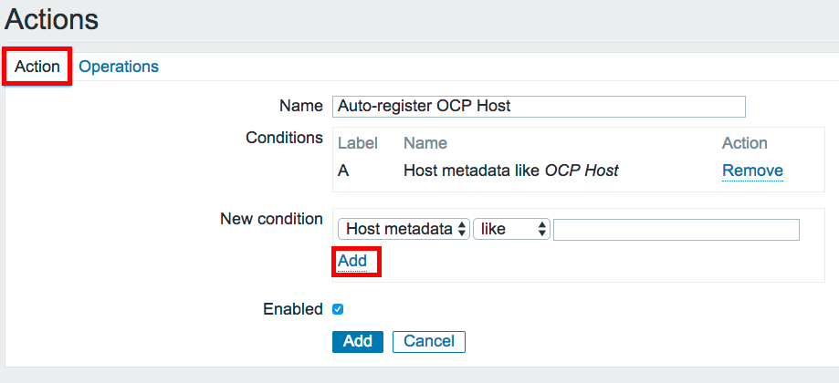
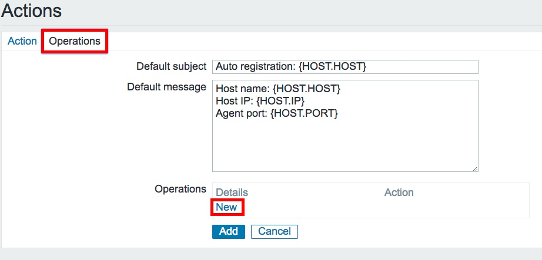
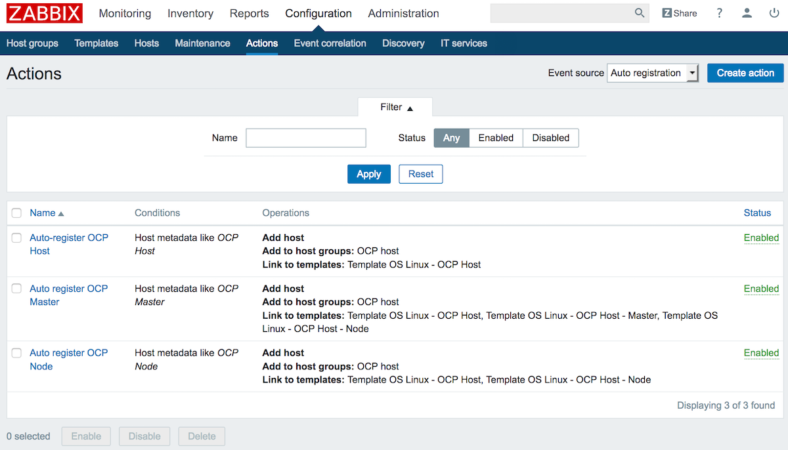
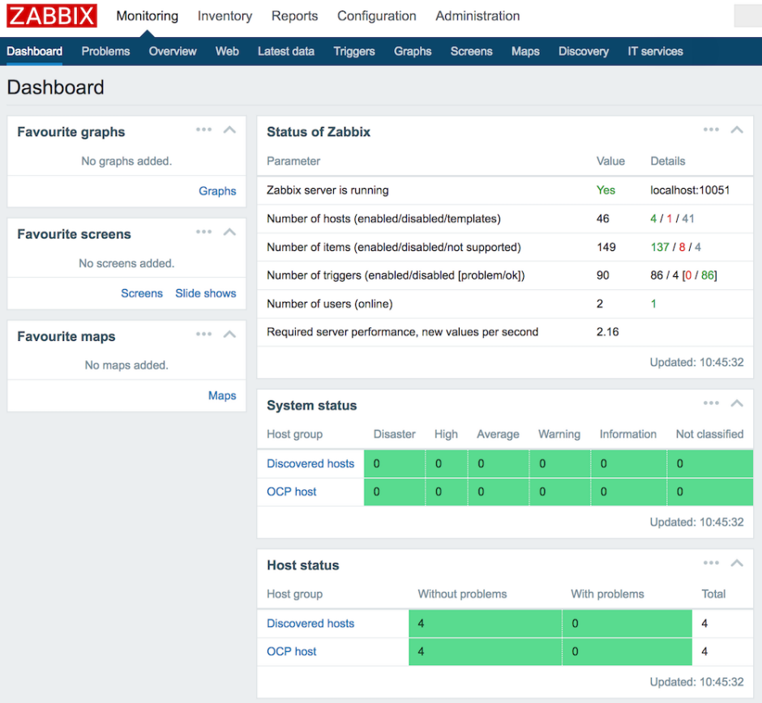
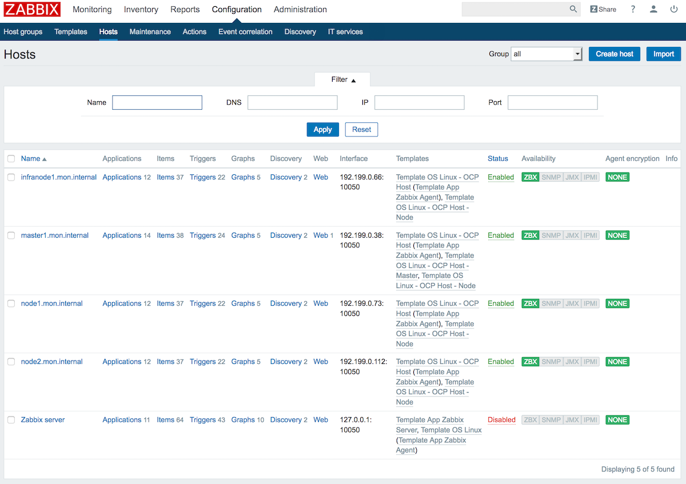

:scrollbar:
:data-uri:
:toc2:
:linkattrs:
:course_name: Red Hat OpenShift Operations
:latest_maria_db: false
:latest_zabbix: false

==  Zabbix Installion Lab

:numbered:

==== Preliminary Important Notes

. *Performance*: The lab environment is cloudased, so you can access it over
 the WAN from anywhere. However, do not expect its performance to match a
  bare-metal environment.

. *Remote Access*: The bastion host is the only host that you can access with
 SSH outside the lab environment. External SSH for all other hosts is blocked.
  From the bastion host, you can access the other hosts internally through SSH.
   As described earlier, you must access the system (not as `root`) with your
    private SSH key and OPENTLC login.

. *GUID*: Each lab environment is assigned a global unique identifier (GUID)
 with four characters, which you receive by email when provisioning your lab
  environment. *From this point on, replace _GUID_ with your lab's four-character GUID.*

. *Bastion host* is *not* an OpenShift cluster member or part of the OpenShift
 environment. The bastion host mimics your client's infrastructure or your
  laptop or desktop that is connected to the client's local area network (LAN).
+
[TIP]
It is recommended to use a terminal multiplexing tool, such as
 *tmux* or *screen*, which keeps your place in the session if you are
  disconnected from your environment. You can install their packages after
   setting up the `rhel` repositories `yum install tmux`.
If you use tmux, type *Ctrl+B* (to enter "scroll mode") + page up or down to
 scroll, and use the *Esc* key to exit scroll mode.
You can detach from tmux : `Ctrl+B  D` or simply close you terminal. To attach
 again an existing tmux session, run the command `tmux attach` once you're
  connected to the bastion host.
+
. Provisioned Environment Hosts

These are the hosts that have been deployed in your lab environment:

* Bastion (administration) server: `bastion.GUID.example.opentlc.com`, `bastion.GUID.internal`
* NFS server: `support1.GUID.example.opentlc.com`, `support1.GUID.internal`
* Load balancer: `loadbalancer.GUID.example.opentlc.com`, `loadbalancer1.GUID.internal`
* 3 OpenShift master nodes: `master{1,2,3}.GUID.example.opentlc.com`, `master{1,2,3}.GUID.internal`
* 2 OpenShift infrastructure nodes: `infranode{1,2}.GUID.example.opentlc.com`, `infranode{1,2}.GUID.internal`
* 1 OpenShift worker node: `node1.GUID.example.opentlc.com`, `node1.GUID.internal`
* IPA Server: `ipa.shared.example.opentlc.com` (shared resource for all students)

==== Connect to Bastion Host and Explore your environment

When you connect to `bastion.GUID.example.opentlc.com` for the first time, you
will have to accept the server SSH fingerprint. Reply 'yes': it will be added
 to your `known_hosts` and not asked next time you connect.

. Connect to your administration host `bastion.GUID.example.opentlc.com`. Note that your private key location may vary.
+
[source,bash]
----
yourdesktop$ ssh -i ~/.ssh/studentkey ec2-user@bastion.GUID.example.opentlc.com
----
+
* Example of a successful connection:
+
[source,bash]
----
[gucore@work ~]$ ssh -i ~/.ssh/studentkey ec2-user@bastion.9e91.example.opentlc.com
----
+
[source,text]
----
The authenticity of host 'bastion.9e91.example.opentlc.com (31.220.66.121)' can't be established.
ECDSA key fingerprint is SHA256:fR4vFVswyvpj/Jevfin3+X0Fkehbfx4HBjw46AeIS14.
ECDSA key fingerprint is MD5:bb:25:92:ee:c9:ba:23:71:b7:c1:f7:2d:89:6d:b0:66.
Are you sure you want to continue connecting (yes/no)? yes
Warning: Permanently added 'bastion.9e91.example.opentlc.com,31.220.66.121' (ECDSA) to the list of known hosts.
Creating home directory for ec2-user.
[ec2-userbastion.9e91 ~]$
----

. Run `sudo -i` to become the `root` user on the bastion host:
+
[source,bash]
----
sudo -i
----
+
. Ensure that you have a GUID environment variable set to make entering commands
easier
+
[source,bash]
----
echo ${GUID}
----
+
The output should be your GUID.
+
If the output is NOT your GUID, execute the following to set your unique identifier as the GUID environment variable:
+
[source,bash]
----
export GUID=$(hostname | cut -d. -f2)
----
+
Validate that it is set, and add it to your profile.
+
[source,bash]
----
echo ${GUID}; echo "export GUID=${GUID}" >> /root/.bashrc
----

. A sample Ansible inventory file with host in your environment has been created
 for you, have a look at `/etc/ansible/hosts`
+
[source,bash]
----
cat /etc/ansible/hosts
----
+
. Use the Ansible `--list-hosts` command line to list the masters, nodes, and
 all of the host groups:
+
.. List the "masters" host group:
+
[source,bash]
----
ansible masters --list-hosts
----
+
Expect the output to look similar to this:
+
[source,text]
----
  hosts (3):
    master1.GUID.internal
    master2.GUID.internal
    master3.GUID.internal
----
+
.. List the "nodes" host group (Remember, Masters are Nodes too):
+
[source,bash]
----
ansible nodes --list-hosts
----
+
Expect the output to look similar to this:
+
[source,bash]
----
hosts (8):
    master1.GUID.internal
    master2.GUID.internal
    master3.GUID.internal
    infranode1.GUID.internal
    infranode2.GUID.internal
    node1.GUID.internal
    node2.GUID.internal
----
+
.. List the "all" host group:
+
[source,bash]
----
ansible all --list-hosts
----
+
Expect the output to look similar to this:
+
[source,text]
----
hosts (10):
    master1.GUID.internal
    master2.GUID.internal
    master3.GUID.internal
    infranode1.GUID.internal
    infranode2.GUID.internal
    node1.GUID.internal
    node2.GUID.internal
    loadbalancer1.GUID.internal
    support1.GUID.internal
----
+
. Test the Ansible configuration by using the Ansible "ping" module to contact all
the hosts.  This also ensures that all the hosts are running.:
+
[source,bash]
----
ansible all -m ping
----
+
Expect the output to look similar to this:
+
[source,text]
----
loadbalancer1.GUID.internal | SUCCESS => {
    "changed": false,
    "failed": false,
    "ping": "pong"
}
infranode1.GUID.internal | SUCCESS => {
    "changed": false,
    "failed": false,
    "ping": "pong"
}
master2.GUID.internal | SUCCESS => {
    "changed": false,
    "failed": false,
    "ping": "pong"
}
master3.GUID.internal | SUCCESS => {
    "changed": false,
    "failed": false,
    "ping": "pong"
}
master1.GUID.internal | SUCCESS => {
    "changed": false,
    "failed": false,
    "ping": "pong"
}
infranode2.GUID.internal | SUCCESS => {
    "changed": false,
    "failed": false,
    "ping": "pong"
}
node1.GUID.internal | SUCCESS => {
    "changed": false,
    "failed": false,
    "ping": "pong"
}
node2.GUID.internal | SUCCESS => {
    "changed": false,
    "failed": false,
    "ping": "pong"
}
support1.GUID.internal | SUCCESS => {
    "changed": false,
    "failed": false,
    "ping": "pong"
}
node3.GUID.internal | SUCCESS => {
    "changed": false,
    "failed": false,
    "ping": "pong"
}
----

== Set Up Zabbix Server

In this section, you install the Zabbix Server. In this environment, you use the `Bastion` VM to run the Zabbix Server. Zabbix is located on `bastion.${GUID}.example.opentlc.com`.

ifeval::[{latest_zabbix} != true]
[TIP]
You can find detailed installation instructions for Zabbix Server at link:https://www.zabbix.com/documentation/3.2/manual/installation/install_from_packages/server_installation_with_mysql[Zabbix Server Installation with MySQL^].

endif::[]
ifeval::[{latest_zabbix} == true]
[TIP]
You can find detailed installation instructions for Zabbix Server at link:
https://www.zabbix.com/documentation/3.4/manual/installation/install_from_packages/rhel_centos["Zabbix Installation Instructions for Red Hat Enterprise Linux/Centos^"].

endif::[]

=== Install Zabbix Server

. Make sure you are logged in to your Bastion VM as `root`.

. Add the repository for Zabbix:
+
ifeval::[{latest_zabbix} != true]
[source,bash]
----
rpm -ivh http://repo.zabbix.com/zabbix/3.2/rhel/7/x86_64/zabbix-release-3.2-1.el7.noarch.rpm
----
endif::[]

ifeval::[{latest_zabbix} == true]
[source,bash]
----
rpm -ivh http://repo.zabbix.com/zabbix/3.4/rhel/7/x86_64/zabbix-release-3.4-1.el7.centos.noarch.rpm
----
endif::[]

ifeval::[{latest_maria_db} == true]

. Because Zabbix requires a MySQL database, you install the MariaDB database, which is a fully open source clone of MySQL.

. Create a `/etc/yum.repos.d/MariaDB.repo` file:
+
[source,text]
----
# MariaDB 10.2 RedHat repository list - created 2017-07-27 15:16 UTC
# http://downloads.mariadb.org/mariadb/repositories/
[mariadb]
name = MariaDB
baseurl = http://yum.mariadb.org/10.2/rhel7-amd64
gpgkey=https://yum.mariadb.org/RPM-GPG-KEY-MariaDB
gpgcheck=1
----
endif::[]

. Install MariaDB Server, MariaDB Client, Apache HTTP Server, and Zabbix Server:
+
[source,bash]
----
yum repolist
yum -y install mariadb-server mariadb zabbix-server-mysql zabbix-web-mysql httpd
systemctl enable mariadb
systemctl start mariadb
----

. Run `mysql_secure_installation` to set up your MariaDB instance with recommended security settings:
+
[source,bash]
----
mysql_secure_installation
----
* This also allows you to set a root password for your database. You may replace `MariaDB-Root` with a root password of your choice--just make sure you use the same password whenever the database root password is required.

. Once the script runs and you are prompted for input, enter the following values:
* *Enter current password for root (enter for none)*: `Enter`
* *Set root password? [Y/n]* `Y`
* *New password*: `MariaDB-Root`
* *Re-enter new password*: `MariaDB-Root`

. Type `Enter` to accept the defaults on all of the other prompts.

. Create the Zabbix database, replacing `Zabbix-Root` with the password you chose:
+
[source,bash]
----
mysql -uroot -pMariaDB-Root

mysql> create database zabbix character set utf8 collate utf8_bin;
mysql> grant all privileges on zabbix.* to zabbix@localhost identified by 'Zabbix-Root';
mysql> quit;
----

. Populate the newly created database with Zabbix tables:
+
ifeval::[{latest_zabbix} != true]
[source,bash]
----
zcat /usr/share/doc/zabbix-server-mysql-3.2.*/create.sql.gz | mysql -Dzabbix -uzabbix -pZabbix-Root
----
endif::[]

ifeval::[{latest_zabbix} == true]
[source,bash]
----
zcat /usr/share/doc/zabbix-server-mysql-3.4.*/create.sql.gz | mysql -Dzabbix -uzabbix -pZabbix-Root
----
endif::[]

. Edit `/etc/zabbix/zabbix_server.conf` and update the following values, removing `#` when necessary:
+
[source,text]
----
DBHost=localhost
DBName=zabbix
DBUser=zabbix
DBPassword=Zabbix-Root
----
* Be sure to use your chosen value for `DBPassword`.

. Edit `/etc/selinux/config` and set `SELINUX=permissive` to disable SELinux.
* Zabbix requires SELinux to be turned off.
+
. At the command line, turn off SELinux for the current session:
+
[source,bash]
----
setenforce Permissive
----

. Update the Zabbix web front-end configuration by editing `/etc/httpd/conf.d/zabbix.conf` and updating the following values if necessary:
+
[source,text]
----
php_value max_execution_time 300
php_value memory_limit 128M
php_value post_max_size 16M
php_value upload_max_filesize 2M
php_value max_input_time 300
php_value always_populate_raw_post_data -1
php_value date.timezone America/New_York
----
* Most likely this includes removing the comment and setting the correct time zone.

=== Start Zabbix Server and Configure HTTP

. Enable and start the Zabbix server:
+
[source,bash]
----
systemctl enable zabbix-server
systemctl start zabbix-server
----

. Make sure your Zabbix server is running:
+
[source,bash]
----
systemctl status zabbix-server
----

. Update the Apache HTTP server configuration to redirect `/` to `/zabbix` by opening `/etc/httpd/conf/httpd.conf` for editing, searching for "Redirect", and adding the following line to the `alias_module` section:
+
[source,text]
----
RedirectMatch ^/$ /zabbix
----

. Set SELinux rules for Zabbix to connect to the HTTP server, and enable and start the server:
+
[source,bash]
----
setsebool -P httpd_can_connect_zabbix on
systemctl enable httpd
systemctl start httpd
----

. Make sure your Apache server is running:
+
[source,bash]
----
systemctl status httpd
----

//////////////////////////
WK: This next section is necessary when not running Zabbix on the Bastion host. The Bastion seems to have the firewall turned off.
=== Enable Firewall Ports

Default firewall rules prohibit access to the HTTP server port. In addition, Zabbix agents need access to port `10051` to automatically register themselves with the server. In this section, you enable ports `80` and `10051` on the firewall.

. Edit `/etc/sysconfig/iptables` and add the following two lines after the line that accepts traffic on port `22`:
+
[source,text]
----
-A INPUT -p tcp -m state --state NEW -m tcp --dport 80 -j ACCEPT
-A INPUT -p tcp -m state --state NEW -m tcp --dport 10051 -j ACCEPT
----

* Expect the section to look like this:
+
[source,text]
----
-A INPUT -i lo -j ACCEPT
-A INPUT -p tcp -m state --state NEW -m tcp --dport 22 -j ACCEPT
-A INPUT -p tcp -m state --state NEW -m tcp --dport 80 -j ACCEPT
-A INPUT -p tcp -m state --state NEW -m tcp --dport 10051 -j ACCEPT
----

. Save the file, restart the `iptables` service, and make sure your rules are now active:
+
[source,bash]
----
systemctl restart iptables
iptables --list
----
+
.Sample Output
[source,text]
----
Chain INPUT (policy ACCEPT)
target     prot opt source               destination
ACCEPT     all  --  anywhere             anywhere             state RELATED,ESTABLISHED
ACCEPT     icmp --  anywhere             anywhere
ACCEPT     all  --  anywhere             anywhere
ACCEPT     tcp  --  anywhere             anywhere             state NEW tcp dpt:ssh
ACCEPT     tcp  --  anywhere             anywhere             state NEW tcp dpt:http
ACCEPT     tcp  --  anywhere             anywhere             state NEW tcp dpt:zabbix-trapper
REJECT     all  --  anywhere             anywhere             reject-with icmp-host-prohibited
[...]
----
//////////////////////////

== Configure Zabbix Server Front End

In this section, you access the Zabbix server, which starts the front-end configuration process.

. Open your web browser and navigate to `http://bastion.$GUID.example.opentlc.com`:
+
ifeval::[{latest_zabbix} != true]
[TIP]
The documentation to install the Zabbix front end is located at link:https://www.zabbix.com/documentation/3.2/manual/quickstart/login["Zabbix Documentation 3.2^"].
endif::[]

ifeval::[{latest_zabbix} == true]
[TIP]
Documentation to install the Zabbix front end is located at link:https://www.zabbix.com/documentation/3.4/manual/quickstart/login["Zabbix Documentation 3.4^"].
endif::[]

. Follow the prompts of the configuration wizard by clicking *Next step*.
* Make sure your Zabbix database password is the same one you set when configuring the Zabbix database earlier--for example, `Zabbix-Root`).

. Accept the default values for everything else and click *Next step* until you see the success page.

. Click *Finish*.
* Expect to see the Zabbix login page.

. Log in with the `Admin` username and `zabbix` as the password to see the Zabbix dashboard.
* Note that the username and password are case-sensitive.

== Configure Monitoring Templates

. Download the OpenShift host templates from GitHub to your local workstation:
+
[source,bash]
----
curl -o zabbix_ocp_templates.xml https://raw.githubusercontent.com/wkulhanek/openshift-zabbix/3.6/zabbix_ocp_templates.xml
----

. Click *Configuration -> Templates* to bring up the templates screen.

. At the top right corner of the page, click *Import* to import the OpenShift host templates.

. Click *Browse* and select the templates file you just downloaded.

. Click *Import* to import the templates.
+
[NOTE]
====
* By default the template to monitor the master API uses port `443` to check the OpenShift master public API. So if you need to change this to port `8443`:
. Navigate to *Configuration -> Templates -> Template OS Linux - OCP Host - Master*.
. Click *Macros*.
. Change the effective value of your port from `443` to the desired value.
. Click *Update*.
====

== Prepare Zabbix Server for Auto Registration of Zabbix Agents

. Switch to *Configuration -> Actions*.
. From the *Event Source* list in the top right corner, select *Auto registration*.
. Create three actions by clicking *Create action* and adding the following properties:
+
[cols="1,1,3",options-"header"]
|====
|Name |Conditions|Operations
|`Auto-register OCP Host` |`Host Metadata like OCP Host` | *Add Host*; *Add host to host groups*: OCP host; *Link to templates*: Template OS Linux--OCP Host
|`Auto-register OCP Master` |`Host Metadata like OCP Master` | *Add Host*; *Add host to host groups*: OCP host; *Link to templates*: Template OS Linux--OCP Host, Templates OS Linux--OCP Node, Templates OS Linux--OCP Master
|`Auto-register OCP Node` |`Host Metadata like OCP Node` | *Add Host*; *Add host to host groups*: OCP host; *Link to templates*: Template OS Linux--OCP Host, Templates OS Linux - OCP Node
|====
+
[IMPORTANT]
Be careful when creating these Actions. The Zabbix User Interface is not very intuitive and it is very easy to miss a step.

.. After you click the blue *Create action* button you will see a screen to add the Action. This screen has two tabs: *Action* and *Operations*. On the *Actions* specify the Condition and click the _underlined_ *Add* link to save the action. It should be listed in the *Conditions* box like shown below.
+

.. Then you need to switch to the *Operations* tab to add the three operations. On the Operations screen you have to click the _underlined_ *New* link to create a new operation. Select the operation (e.g. *Add host to host groups*) and then specify any optional parameters to the operation again before clicking the _underlined_ *Add* link.
+

+
[TIP]
If you accidentally click the blue *Add* button before you are finished, simply open the item again and resume editing.

* Expect your final configuration to look like this:
+

* Your Zabbix server is now ready to be discovered by Zabbix agents.

. Switch back to the main dashboard by clicking *Monitoring -> Dashboard*.

== Install Zabbix Agents on Nodes

. On your `bastion` host as `root`, clone the `openshift-zabbix` project. This project contains the playbooks and configuration files to set up all of the Zabbix agents on all of the OpenShift nodes:
+
[source,bash]
----
cd /root
git clone https://github.com/wkulhanek/openshift-zabbix
cd openshift-zabbix
git checkout 3.6
----

. Edit the file `zabbix_vars.yml` and make sure that `zabbix_host` points to the Zabbix server you previously installed.
* You will need to change the GUID from `mon` to match your environment.

. Run the playbook to install the agents on all of the nodes:
+
[source,bash]
----
ansible-playbook install-zabbix-agents.yml
----
* The playbook picks up all of the hosts to install the Zabbix agent to from the OpenShift Ansible `/etc/ansible/hosts` configuration file. If your Ansible hosts file is in a different location, include `-i /path/to/your/hosts_file` as a parameter.

. Run the playbook to configure the agents on all of the nodes:
+
[source,bash]
----
ansible-playbook configure-zabbix-agents.yml
----
* This includes everything necessary to deploy and configure the Zabbix agent along with associated scripts to OpenShift nodes. Because you set up automatic discovery of Zabbix agents on the Zabbix server, no other steps are necessary.

. Log in to your Zabbix server and verify that all of the nodes were discovered automatically and added to the list of monitored nodes.
* This may take a few minutes.

. Examine the dashboard and expect it to show all discovered hosts as green--without problems--and that they are part of the `OCP host` group.:
+

. Switch to *Configuration -> Hosts* to see details about the automatically registered OpenShift nodes:
+

* Note how there is a green `ZBX` status indicating that the Zabbix server can communicate with the agent. Also note that there are a number of applications and triggers set up for each host.

Your Zabbix Environment is now fully configured to monitor your environment.

== Explore Zabbix Dashboard

. Explore the Zabbix dashboard further.
. Investigate some of the templates.

In a real-world environment, your next step is to set up alerting to make sure that any abnormality is reported immediately. This can be done via email, Slack, Pager, SMS or other means. In the lab environment, you do not have any of those available, so skip this step. Should something go wrong, an alert is raised but not sent to any recipients. Instead it is displayed on the dashboard.
